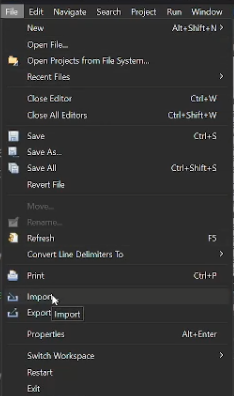
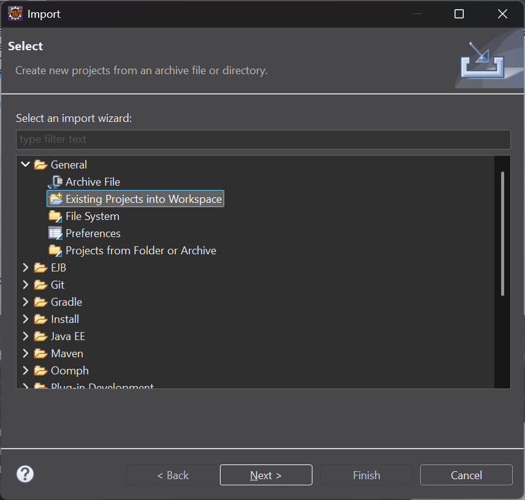
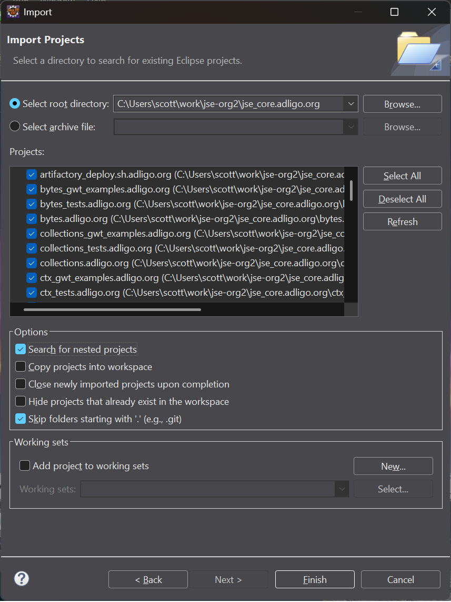
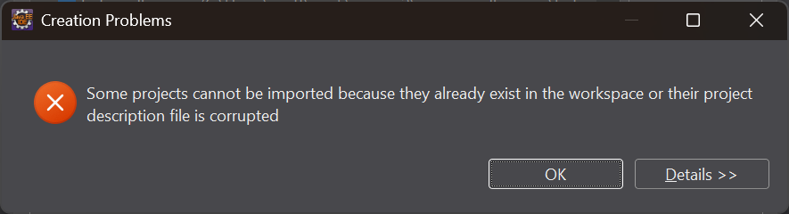
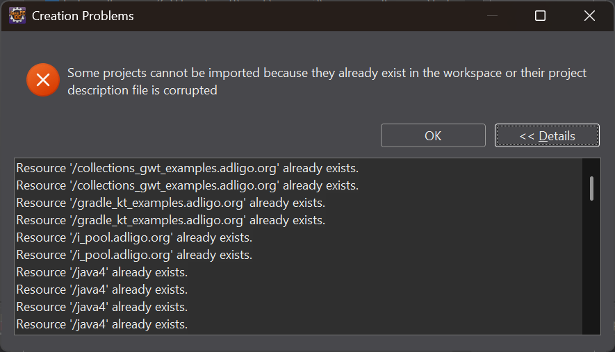
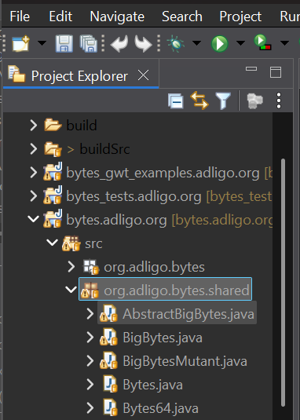
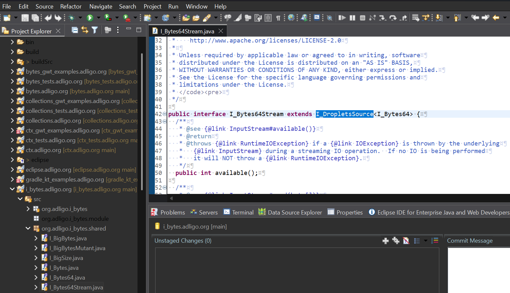

# jse_core.adligo.org setup

- [https://github.com/adligo/jse_core.adligo.org](https://github.com/adligo/jse_core.adligo.org)

I'm currently using a combination of Eclipse and VS Code to develop code associated with the JSE core project, also, sometimes I'm using some of the JetBrains IDEs like IntelliJ, WebStorm and PyCharm.  I don't use IntelliJ much because I don't like the way it rewrites my typing.  Mostly I use Eclipse when it's behaving without auto-save mode on, actually clicking the Save All button.  I often also have the same projects open in VS Code when I'm in Eclipse, so that when Eclipse starts churning on JPA issues, I can just switch directly to VS Code and start typing.  I keep VS Code in auto-save mode and refresh the typing into Eclipse using F5 or right-click and refresh.

# 1) GitBash Command Line Pre-Setup

```
git clone https://github.com/adligo/jse_core.adligo.org.git
cd jse_core.adligo.org
npm run git-clone-or-pull
gradle build --parallel
# note this is super important because it created the .classpath files used by Eclipse
gradle eclipse
```

# 2) Import the Projects into Eclipse

2.1) From the Eclipse File Menu select Import;



2.2) From the dialog open General and select 'Existing Projects into Workspace';



2.3) Select the folder where you have jse_core.adligo.org and then select 'Search for nested projects';



2.4) Click Finish and expect the following errors, then click cancel as the projects are likely already imported correctly;





2.5) Check for Java package folders which should be on a single line;



2.6) Check for source code linkage;

You should be able to open this file, select the I_DropletsSource class name and press F3 to open the I_DropletsSource file directly;



2.7) Get bedazzled by the refactoring menu!

)